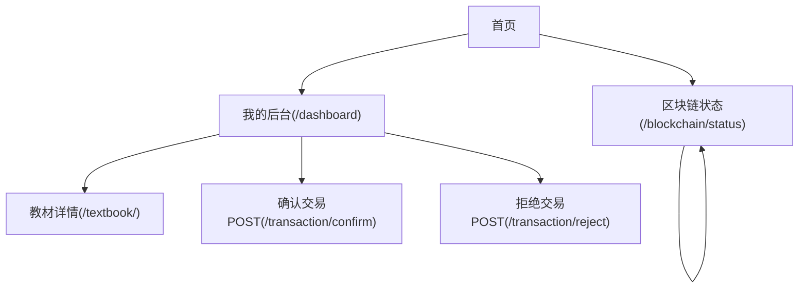

## 1. Product Overview
在不重写任何后端路由的前提下，渐进式引入 Vue.js，对现有 Flask（Jinja）模板页面进行视觉与交互体验升级。
第一阶段仅改造两页：/dashboard 与 /blockchain/status，保持原有数据与业务流程不变。

## 2. Core Features

### 2.1 User Roles
| 角色 | 注册/进入方式 | 核心权限 |
|------|----------------|----------|
| 已登录用户 | 通过现有登录流程进入 | 可访问 /dashboard；可浏览 /blockchain/status；可发起/确认/拒绝交易（沿用现有表单/路由） |
| 未登录用户 | 直接访问 | 仅可浏览 /blockchain/status（模板已根据 session 显示登录/退出入口） |

### 2.2 Feature Module
本阶段需求由以下页面构成：
1. **我的后台（Dashboard）**：统一头部与导航、美化账号信息卡、教材发布列表卡、待确认交易卡、买家交易记录卡、复制用户ID、提交确认/拒绝表单。
2. **区块链状态**：统一头部与导航、美化链状态总览（区块数量/有效性）、区块列表展示（含交易明细）、分页导航（上一页/下一页）。

### 2.3 Page Details
| Page Name | Module Name | Feature description |
|-----------|-------------|---------------------|
| 我的后台（/dashboard） | Vue 渐进式挂载容器 | 在不改变路由的情况下，将页面中“信息卡/列表卡”等区域改为 Vue 组件渲染；保留 Jinja 作为初始 HTML 与数据注入来源。 |
| 我的后台（/dashboard） | 头部与主导航 | 展示站点标题、当前用户标识；提供首页/后台/教材注册/交易/查询/状态/退出等链接（与当前模板一致）。 |
| 我的后台（/dashboard） | 我的账号卡片 | 展示 user_id；支持一键复制 user_id（沿用现有复制能力，升级为更友好的提示样式）。 |
| 我的后台（/dashboard） | 我发布的教材 | 展示教材列表（教材ID、创建时间、位置、描述、照片缩略图、查看详情链接）；支持空状态展示。 |
| 我的后台（/dashboard） | 待确认交易（卖家） | 展示 pending 交易列表（交易ID、教材信息、买家信息、报价、状态、链上哈希）；提供“确认交易/拒绝”提交入口（沿用现有 POST 表单与 action）。 |
| 我的后台（/dashboard） | 我发起的交易（买家） | 展示交易记录（交易ID、教材信息、报价、状态、时间、卖家信息、查看教材详情链接）；支持空状态展示。 |
| 区块链状态（/blockchain/status） | Vue 渐进式挂载容器 | 将“链状态概览/区块列表/分页条”等区域改为 Vue 组件渲染；不改变 URL 与 query 参数 page 的语义。 |
| 区块链状态（/blockchain/status） | 头部与主导航 | 展示站点标题与简介；导航项与当前模板一致，并根据 session 显示登录/退出。 |
| 区块链状态（/blockchain/status） | 链状态概览 | 展示区块数量 chain_length；展示区块链有效性 is_valid 的可视化状态标签。 |
| 区块链状态（/blockchain/status） | 区块详情列表 | 分块展示区块 index、timestamp、previous_hash、hash、交易数量；展开展示交易明细（按当前模板字段条件渲染）。 |
| 区块链状态（/blockchain/status） | 分页导航 | 展示“第 page / total_pages 页”；提供上一页/下一页链接，并在不可用时禁用（保持现有 href 结构）。 |

## 3. Core Process
- 已登录用户流程：登录后进入 /dashboard → 复制用户ID（可选）→ 浏览“我发布的教材/待确认交易/我发起的交易” → 对 pending 交易点击确认或拒绝（提交到现有 /transaction/confirm 或 /transaction/reject）。
- 任意用户流程：访问 /blockchain/status?page=N → 查看链状态概览与区块列表 → 使用上一页/下一页进行分页浏览。

