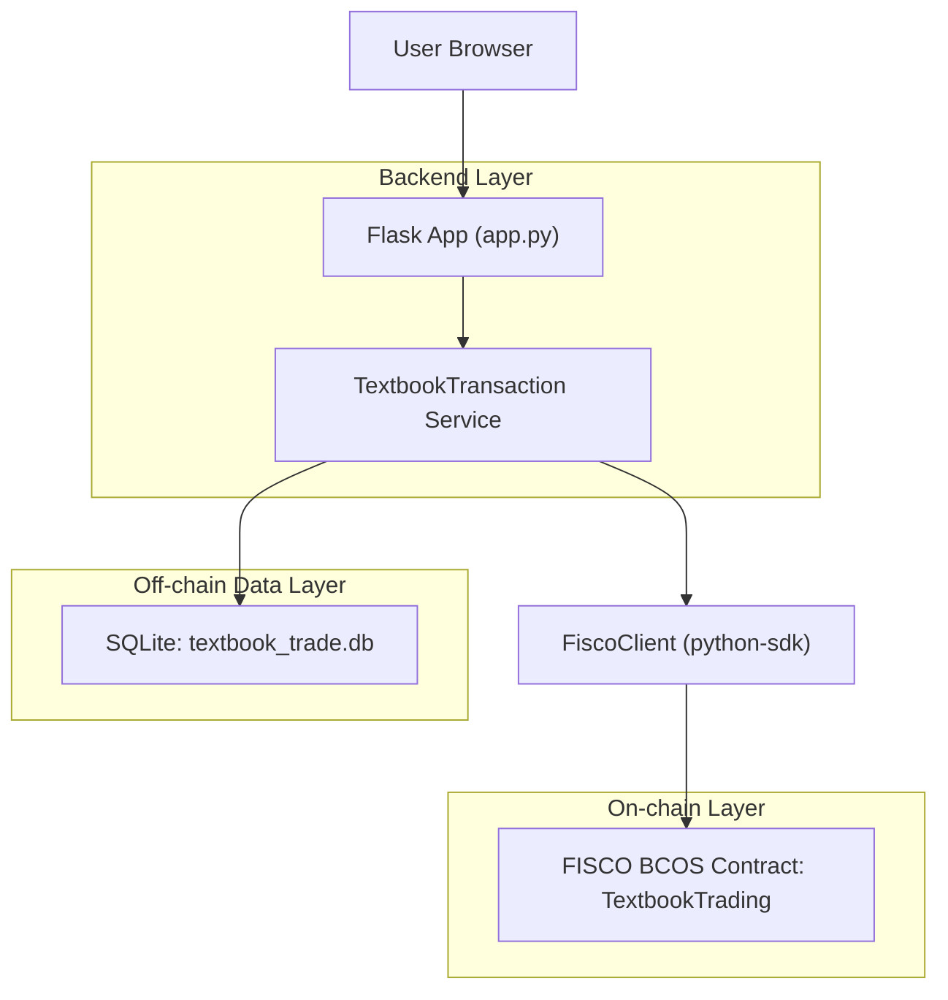
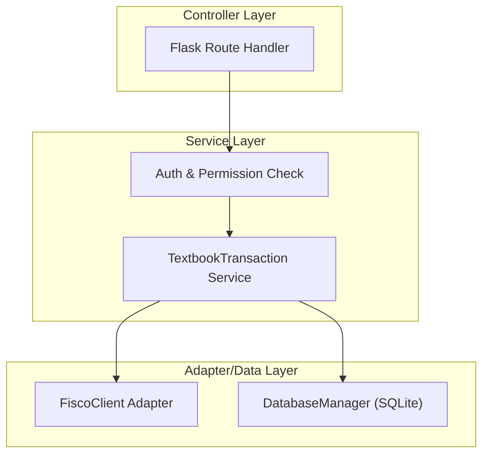
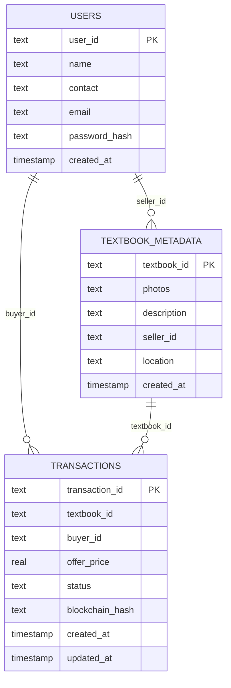

## 1.Architecture design



## 2.Technology Description

* Backend: Python + Flask

* On-chain: Solidity 合约（FISCO BCOS）+ FISCO BCOS Python SDK

* Off-chain storage: SQLite

## 3.Route definitions

| Route                            | Purpose                                    |
| -------------------------------- | ------------------------------------------ |
| /auth/register                   | 注册并写入 users（含密码哈希），建立 session              |
| /auth/login                      | 登录校验 users.password\_hash，建立 session       |
| /auth/logout                     | 清理 session                                 |
| /textbook/register (GET/POST)    | 注册教材：链上写教材 + 链下写教材元数据                      |
| /transaction/initiate (GET/POST) | 发起交易：链上写交易 + 链下写交易记录                       |
| /transaction/confirm (GET/POST)  | 卖家确认：链上确认 + 链下置 completed + 自动拒绝其它 pending |
| /transaction/reject (POST)       | 卖家拒绝：仅链下置 rejected                         |
| /textbook/\<textbook\_id>        | 教材详情：查询链上历史并与链下元数据/交易合并展示                  |
| /dashboard                       | 工作台：卖家教材、卖家待处理订单、买家订单列表                    |
| /textbook/search (GET/POST)      | 按教材ID查询并展示合并信息                             |
| /blockchain/status               | 区块浏览：从链上拉块/解析 input，并用链下数据补全业务信息           |

## 4.API definitions (核心业务对象/方法)

### 4.1 共享数据类型（用于前后端/模板理解）

```ts
type TextbookOnChain = {
  textbook_id: string;
  isbn: string;
  version: string;
  condition: string;
  initial_price: number; // 元（链上存 int 分*100）
};

type TransactionOnChain = {
  transaction_id: string;
  textbook_id: string;
  buyer_address: string;
  offer_price: number; // 元（链上存 int 分*100）
  status: "pending" | "completed";
  timestamp: string;
};

type TextbookMetadataOffChain = {
  textbook_id: string;
  photos: string; // 逗号分隔文件名
  description: string;
  seller_id: string; // 应用内用户ID
  location: string;
  created_at: string;
};

type TransactionOffChain = {
  transaction_id: string;
  textbook_id: string;
  buyer_id: string; // 应用内用户ID
  offer_price: number;
  status: "pending" | "completed" | "rejected";
  blockchain_hash: string;
  created_at: string;
  updated_at: string;
};
```

### 4.2 关键函数（服务层/数据层/链上适配）

* Service：TextbookTransaction.add\_textbook / initiate\_transaction / confirm\_transaction / reject\_transaction / get\_textbook\_history

* DB：DatabaseManager.add\_textbook\_metadata / add\_transaction / update\_transaction / reject\_other\_pending\_transactions / get\_pending\_transactions\_for\_seller

* Chain Adapter：FiscoClient.register\_textbook / initiate\_transaction / confirm\_transaction / get\_textbook / get\_transaction / get\_textbook\_transaction\_count / get\_textbook\_transaction

## 5.Server architecture diagram



## 6.Data model

### 6.1 Data model definition

#### 6.1.1 链上（合约 TextbookTrading.sol）

* struct Textbook：textbookId、isbn、version、condition、initialPrice、exists

* struct Transaction：transactionId、textbookId、buyer、offerPrice、status(pending/completed)、timestamp、exists

* mapping：

  * textbooks\[textbookId] => Textbook

  * transactions\[transactionId] => Transaction

  * textbookTransactions\[textbookId] => transactionId\[]

#### 6.1.2 链下（SQLite）



### 6.2 Data Definition Language

（与 database.py 初始化一致，略去索引）

```sql
CREATE TABLE IF NOT EXISTS users (
  user_id TEXT PRIMARY KEY,
  name TEXT NOT NULL,
  contact TEXT NOT NULL,
  email TEXT,
  password_hash TEXT,
  created_at TIMESTAMP DEFAULT CURRENT_TIMESTAMP
);

CREATE TABLE IF NOT EXISTS textbook_metadata (
  textbook_id TEXT PRIMARY KEY,
  photos TEXT,
  description TEXT,
  seller_id TEXT,
  location TEXT,
  created_at TIMESTAMP DEFAULT CURRENT_TIMESTAMP
);

CREATE TABLE IF NOT EXISTS transactions (
  transaction_id TEXT PRIMARY KEY,
  textbook_id TEXT,
  buyer_id TEXT,
  offer_price REAL,
  status TEXT,
  blockchain_hash TEXT,
  created_at TIMESTAMP DEFAULT CURRENT_TIMESTAMP,
  updated_at TIMESTAMP DEFAULT CURRENT_TIMESTAMP
);
```

## 7.链上 / 链下字段划分（核心约束）

| 业务对象 | 字段                                    | 存储位置    | 说明                                                        |
| ---- | ------------------------------------- | ------- | --------------------------------------------------------- |
| 教材   | textbook\_id                          | 链上 + 链下 | 链上主键；链下作为元数据/关联键                                          |
| 教材   | isbn/version/condition/initial\_price | 链上      | 合约 Textbook 结构体字段（价格链上按 \*100 存 int）                      |
| 教材   | photos/description/location           | 链下      | 展示与检索辅助信息，不上链                                             |
| 教材   | seller\_id                            | 链下      | 业务权限依据（卖家确认/拒绝）；合约未存卖家                                    |
| 交易   | transaction\_id                       | 链上 + 链下 | 链上主键；链下用于业务状态/关联用户                                        |
| 交易   | buyer\_address                        | 链上      | 来自 msg.sender（注意：在当前实现中通常是“后端节点账户地址”，非 buyer\_id）         |
| 交易   | buyer\_id                             | 链下      | 应用用户ID，用于页面展示/权限/列表                                       |
| 交易   | offer\_price                          | 链上 + 链下 | 链上记录报价；链下保存浮点元（展示与列表用）                                    |
| 交易   | status                                | 链上 + 链下 | 链上：pending/completed；链下：pending/completed/rejected（拒绝仅链下） |
| 交易   | timestamp                             | 链上      | 合约写入 block.timestamp；服务层做 ISO 格式化                         |
| 交易   | blockchain\_hash                      | 链下      | 保存链上回执中的交易哈希，用于区块浏览/追溯                                    |
| 用户   | password\_hash/email/contact/name     | 链下      | 账号体系完全链下；session 驱动权限                                     |

## 8.后端完整流程（注册教材→发起交易→卖家确认/拒绝→自动拒绝其它订单→查询展示）

### 8.1 注册教材

* 入口路由：POST /textbook/register

* 链上：TextbookTransaction.add\_textbook → FiscoClient.register\_textbook → 合约 registerTextbook(textbookId,isbn,version,condition,initialPrice)

* 链下：DatabaseManager.add\_textbook\_metadata(textbook\_id, photos, description, seller\_id(session), location)

* 输出：302 跳转 /textbook/\<textbook\_id>

### 8.2 发起交易

* 入口路由：POST /transaction/initiate

* 链上：TextbookTransaction.initiate\_transaction → 合约 initiateTransaction(transactionId,textbookId,offerPrice)

* 链下：DatabaseManager.add\_transaction(transaction\_id, textbook\_id, buyer\_id(session), offer\_price, status='pending', blockchain\_hash)

* 输出：302 跳转 /textbook/\<textbook\_id>

### 8.3 卖家确认 / 拒绝

#### 确认

* 入口路由：POST /transaction/confirm

* 权限：用 textbook\_metadata.seller\_id 与 session.user\_id 校验“只有卖家可确认”

* 链上：TextbookTransaction.confirm\_transaction → 合约 confirmTransaction(transactionId)

* 链下：DatabaseManager.update\_transaction(status='completed', blockchain\_hash可更新)

#### 拒绝

* 入口路由：POST /transaction/reject

* 权限：同上（只有卖家可拒绝）

* 链下：TextbookTransaction.reject\_transaction → DatabaseManager.update\_transaction(status='rejected')

* 说明：当前实现“不上链拒绝”，合约也未定义 rejected 状态

### 8.4 自动拒绝其它订单（同一本教材）

* 触发点：确认交易成功后（confirm\_transaction）

* 链下：DatabaseManager.reject\_other\_pending\_transactions(textbook\_id, accepted\_transaction\_id)

* 结果：将同 textbook\_id 且 status='pending' 的其它交易全部置为 rejected（仅链下）

### 8.5 查询展示（链上/链下合并）

#### 教材详情/交易历史

* 入口路由：GET /textbook/\<textbook\_id>

* 服务：TextbookTransaction.get\_textbook\_history

  * 优先链上：getTextbook + getTextbookTransactionCount + getTextbookTransaction + getTransaction

  * 合并链下：用 transactions 表补齐 buyer\_id、blockchain\_hash，并以链下 status/offer\_price 为准

  * 回退：链不可用时，使用 SQLite transactions 生成历史

#### 工作台列表

* 入口路由：GET /dashboard

* 链下查询：

  * get\_textbooks\_by\_seller

  * get\_pending\_transactions\_for\_seller（JOIN users/textbook\_metadata 展示买家与教材信息）

  * get\_transactions\_by\_buyer

#### 区块浏览

* 入口路由：GET /blockchain/status

* 链上拉取：getBlockByNumber，并用 DatatypeParser.parse\_transaction\_input 解析 input

* 链下补全：通过 db\_manager.get\_transaction / users / textbook\_metadata 补齐 buyer/seller 名称与业务状态

