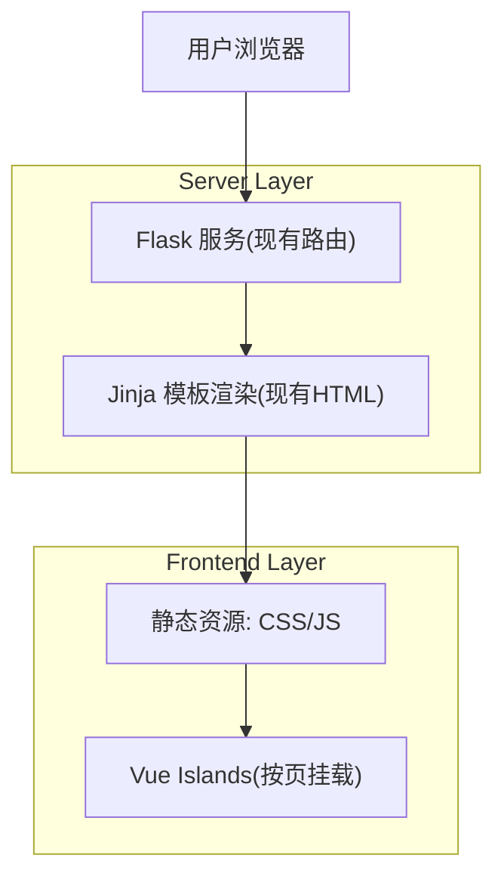

## 1.Architecture design

## 2.Technology Description
- Frontend: Vue@3 + Vite + TypeScript（可选但推荐） + tailwindcss@3（用于快速美化与一致性）
- Backend: Flask（保持现状，不重写任何路由与业务处理）

## 3.Route definitions
| Route | Purpose |
|-------|---------|
| /dashboard | 个人后台：账号信息、教材列表、交易列表；本阶段为 Vue 渐进式改造重点页 |
| /blockchain/status?page=N | 区块链状态与区块列表分页展示；本阶段为 Vue 渐进式改造重点页 |

## 4. 渐进式引入方案（不改路由）
1) 保持“服务端首屏渲染”：
- 继续由 Jinja 输出可用的 HTML（SEO/可访问性/无JS可用）。
- Vue 仅接管页面中的局部区域（卡片、列表、分页条），避免一次性重写整页。

2) 数据来源策略（不新增 API、避免改后端）：
- 由 Jinja 将当前上下文数据序列化注入到页面，例如：
  - 在模板中输出 ``
  - Vue 启动时读取该 JSON 作为初始 state
- 需要分页跳转时，继续使用现有 `<a href="/blockchain/status?page=...">` 方案（Vue 只做样式与禁用态渲染）。

3) 资源交付策略（推荐 Vite 构建，按页拆分入口）：
- 每个页面一个入口：dashboard.ts、blockchain-status.ts
- 构建产物输出到 Flask 可访问的静态目录（例如 `textbook_blockchain_system/static/dist/`）
- 在对应 Jinja 模板底部以 `<script type="module" src="...">` 引入，避免影响其它页面。

4) 与现有模板共存的“挂载点”约定：
- /dashboard：在 `.container` 内新增（或替换现有块）`

`
- /blockchain/status：在 `.card` 内新增 `#blockchain-status-app`
- 旧 DOM 可先保留作为 fallback，再逐块迁移为 Vue 组件。

5) 风险与约束控制
- 约束：不修改路由与表单提交目标（action 保持 /transaction/confirm、/transaction/reject 等）。
- 风险：Jinja 与 Vue 双渲染导致样式冲突。
  - 控制：Vue 组件统一 BEM/命名空间类前缀（如 `.v-`），并将全局样式从页面内联逐步抽到公共 CSS。
- 风险：模板中的条件字段较多（blockchain_status 交易明细字段可选）。
  - 控制：将“字段存在才显示”的逻辑封装到 Vue 子组件中，并对缺失字段使用与当前模板一致的兜底文案（如“无/未知”）。

## 5.Server architecture diagram
（无新增后端服务，本阶段不需要单独的服务端分层图。）

## 6.Data model
（本阶段不新增数据库/表结构；沿用现有链下数据库与区块链数据结构。）
