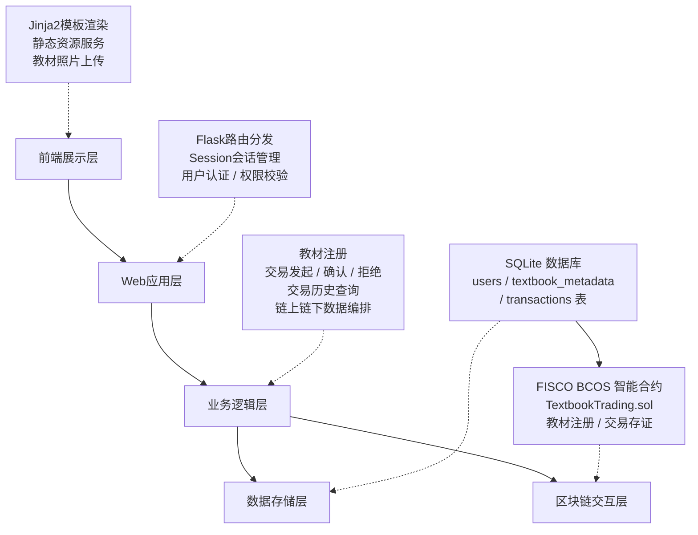

```mermaid
graph TD
    A[前端展示层] --> B[Web应用层]
    B --> C[业务逻辑层]
    C --> D[数据存储层]
    C --> E[区块链交互层]

    A1["Jinja2模板渲染<br/>静态资源服务<br/>教材照片上传"] -.-> A
    B1["Flask路由分发<br/>Session会话管理<br/>用户认证 / 权限校验"] -.-> B
    C1["教材注册<br/>交易发起 / 确认 / 拒绝<br/>交易历史查询<br/>链上链下数据编排"] -.-> C
    D1["SQLite 数据库<br/>users / textbook_metadata<br/>/ transactions 表"] -.-> D
    E1["FISCO BCOS 智能合约<br/>TextbookTrading.sol<br/>教材注册 / 交易存证"] -.-> E

    D1 --> E1
```