## 系统整体分层架构概览

> 数据访问层以及区块链网络层，各层职责明确、接口清晰，层与层之间借助标准化调用实现解耦。

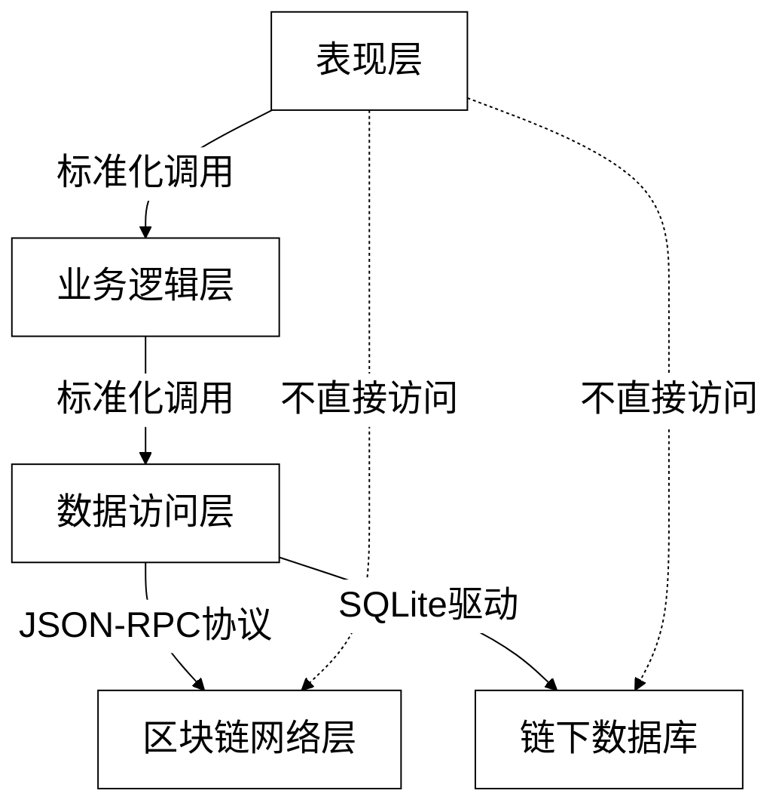
```mermaid
%%{init: {'theme': 'base', 'themeVariables': {'fontSize': '24px', 'primaryColor': '#ffffff', 'primaryTextColor': '#000000', 'primaryBorderColor': '#000000', 'lineColor': '#000000', 'secondaryColor': '#ffffff', 'tertiaryColor': '#ffffff', 'background': '#ffffff', 'mainBkg': '#ffffff', 'nodeBorder': '#000000', 'clusterBkg': '#ffffff', 'clusterBorder': '#000000', 'titleColor': '#000000', 'edgeLabelBackground': '#ffffff', 'nodeTextColor': '#000000'}}}%%
graph TD
    表现层 -->|标准化调用| 业务逻辑层
    业务逻辑层 -->|标准化调用| 数据访问层
    数据访问层 -->|JSON-RPC协议| 区块链网络层
    数据访问层 -->|SQLite驱动| 链下数据库

    表现层 -.->|不直接访问| 区块链网络层
    表现层 -.->|不直接访问| 链下数据库
```

## 表现层

> 基于Flask模板引擎与Vue.js前端框架构建，负责用户交互界面的渲染以及响应。

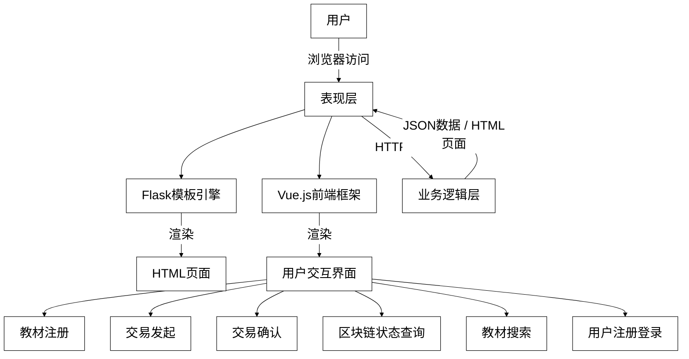
```mermaid
%%{init: {'theme': 'base', 'themeVariables': {'fontSize': '24px', 'primaryColor': '#ffffff', 'primaryTextColor': '#000000', 'primaryBorderColor': '#000000', 'lineColor': '#000000', 'secondaryColor': '#ffffff', 'tertiaryColor': '#ffffff', 'background': '#ffffff', 'mainBkg': '#ffffff', 'nodeBorder': '#000000', 'clusterBkg': '#ffffff', 'clusterBorder': '#000000', 'titleColor': '#000000', 'edgeLabelBackground': '#ffffff', 'nodeTextColor': '#000000'}}}%%
graph TD
    用户 -->|浏览器访问| 表现层

    表现层 --> Flask模板引擎
    表现层 --> Vue.js前端框架

    Flask模板引擎 -->|渲染| HTML页面
    Vue.js前端框架 -->|渲染| 用户交互界面

    用户交互界面 --> 教材注册
    用户交互界面 --> 交易发起
    用户交互界面 --> 交易确认
    用户交互界面 --> 区块链状态查询
    用户交互界面 --> 教材搜索
    用户交互界面 --> 用户注册登录

    表现层 -->|HTTP请求| 业务逻辑层
    业务逻辑层 -->|JSON数据 / HTML页面| 表现层
```

## 业务逻辑层

> 系统核心枢纽，由TextbookTransaction教材交易业务类与DatabaseManager数据库管理类组成。

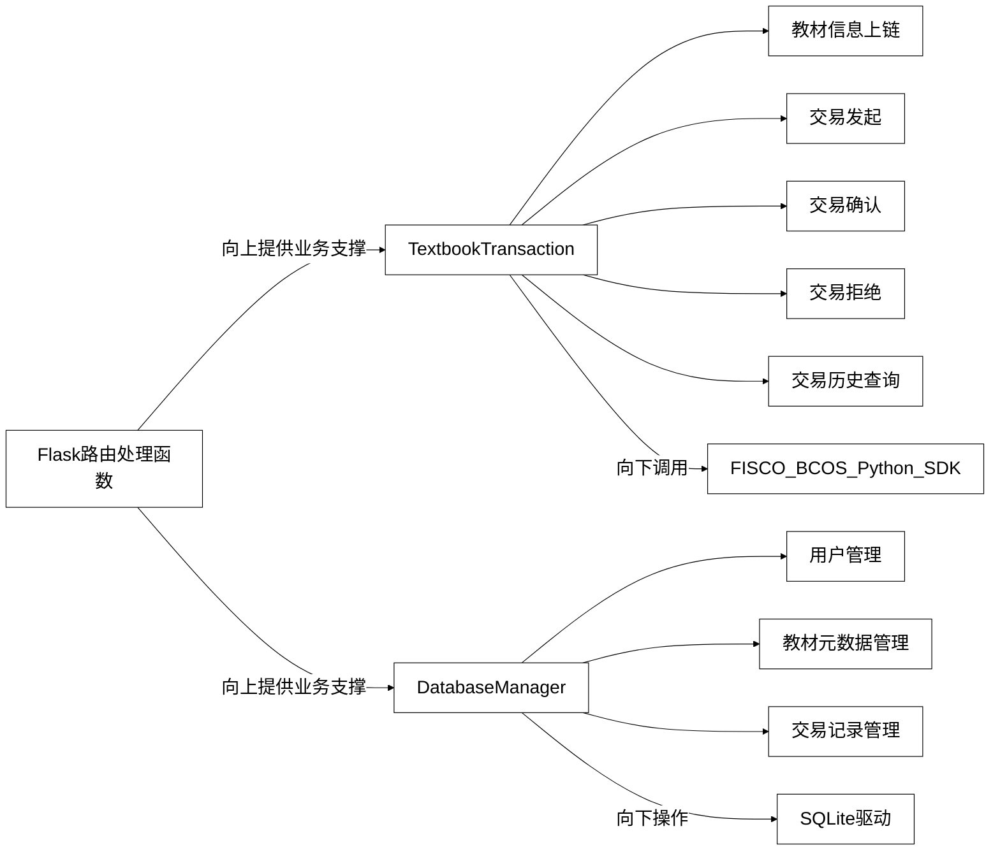
```mermaid
%%{init: {'theme': 'base', 'themeVariables': {'fontSize': '24px', 'primaryColor': '#ffffff', 'primaryTextColor': '#000000', 'primaryBorderColor': '#000000', 'lineColor': '#000000', 'secondaryColor': '#ffffff', 'tertiaryColor': '#ffffff', 'background': '#ffffff', 'mainBkg': '#ffffff', 'nodeBorder': '#000000', 'clusterBkg': '#ffffff', 'clusterBorder': '#000000', 'titleColor': '#000000', 'edgeLabelBackground': '#ffffff', 'nodeTextColor': '#000000'}}}%%
graph LR
    Flask路由处理函数 -->|向上提供业务支撑| TextbookTransaction
    Flask路由处理函数 -->|向上提供业务支撑| DatabaseManager

    TextbookTransaction --> 教材信息上链
    TextbookTransaction --> 交易发起
    TextbookTransaction --> 交易确认
    TextbookTransaction --> 交易拒绝
    TextbookTransaction --> 交易历史查询

    DatabaseManager --> 用户管理
    DatabaseManager --> 教材元数据管理
    DatabaseManager --> 交易记录管理

    TextbookTransaction -->|向下调用| FISCO_BCOS_Python_SDK
    DatabaseManager -->|向下操作| SQLite驱动
```

## 数据访问层

> 由两条并行的数据通道构成：链上数据通道以及链下数据通道。

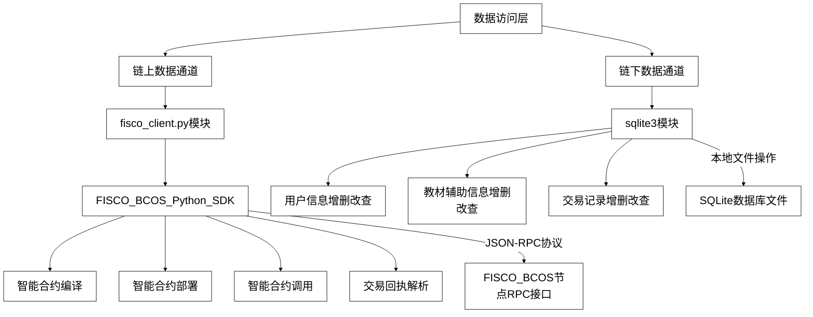
```mermaid
%%{init: {'theme': 'base', 'themeVariables': {'fontSize': '24px', 'primaryColor': '#ffffff', 'primaryTextColor': '#000000', 'primaryBorderColor': '#000000', 'lineColor': '#000000', 'secondaryColor': '#ffffff', 'tertiaryColor': '#ffffff', 'background': '#ffffff', 'mainBkg': '#ffffff', 'nodeBorder': '#000000', 'clusterBkg': '#ffffff', 'clusterBorder': '#000000', 'titleColor': '#000000', 'edgeLabelBackground': '#ffffff', 'nodeTextColor': '#000000'}}}%%
graph TD
    数据访问层 --> 链上数据通道
    数据访问层 --> 链下数据通道

    链上数据通道 --> fisco_client.py模块
    fisco_client.py模块 --> FISCO_BCOS_Python_SDK
    FISCO_BCOS_Python_SDK --> 智能合约编译
    FISCO_BCOS_Python_SDK --> 智能合约部署
    FISCO_BCOS_Python_SDK --> 智能合约调用
    FISCO_BCOS_Python_SDK --> 交易回执解析
    FISCO_BCOS_Python_SDK -->|JSON-RPC协议| FISCO_BCOS节点RPC接口

    链下数据通道 --> sqlite3模块
    sqlite3模块 --> 用户信息增删改查
    sqlite3模块 --> 教材辅助信息增删改查
    sqlite3模块 --> 交易记录增删改查
    sqlite3模块 -->|本地文件操作| SQLite数据库文件
```

## 区块链网络层

> FISCO BCOS多节点联盟链，可信数据底座。

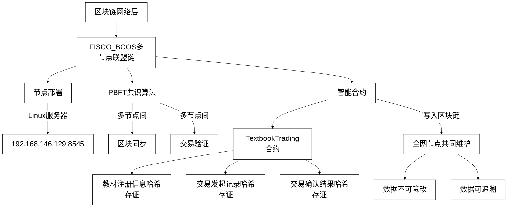
```mermaid
%%{init: {'theme': 'base', 'themeVariables': {'fontSize': '24px', 'primaryColor': '#ffffff', 'primaryTextColor': '#000000', 'primaryBorderColor': '#000000', 'lineColor': '#000000', 'secondaryColor': '#ffffff', 'tertiaryColor': '#ffffff', 'background': '#ffffff', 'mainBkg': '#ffffff', 'nodeBorder': '#000000', 'clusterBkg': '#ffffff', 'clusterBorder': '#000000', 'titleColor': '#000000', 'edgeLabelBackground': '#ffffff', 'nodeTextColor': '#000000'}}}%%
graph TD
    区块链网络层 --> FISCO_BCOS多节点联盟链

    FISCO_BCOS多节点联盟链 --> 节点部署
    节点部署 -->|Linux服务器| 192.168.146.129:8545

    FISCO_BCOS多节点联盟链 --> PBFT共识算法
    PBFT共识算法 -->|多节点间| 区块同步
    PBFT共识算法 -->|多节点间| 交易验证

    FISCO_BCOS多节点联盟链 --> 智能合约
    智能合约 --> TextbookTrading合约
    TextbookTrading合约 --> 教材注册信息哈希存证
    TextbookTrading合约 --> 交易发起记录哈希存证
    TextbookTrading合约 --> 交易确认结果哈希存证

    智能合约 -->|写入区块链| 全网节点共同维护
    全网节点共同维护 --> 数据不可篡改
    全网节点共同维护 --> 数据可追溯
```

## 分层架构优势与降级机制

> 各层之间职责分离以及松耦合，节点不可用时自动降级为SQLite离线模式。

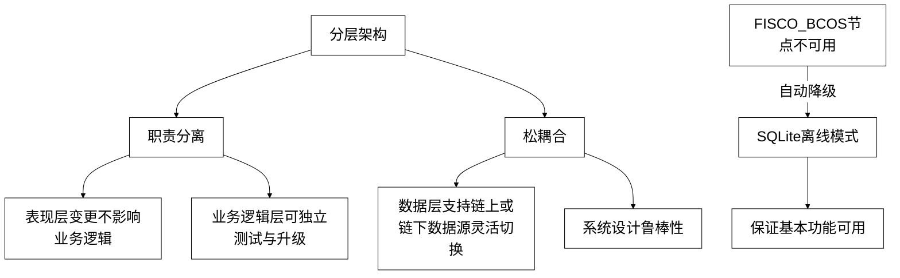
```mermaid
%%{init: {'theme': 'base', 'themeVariables': {'fontSize': '24px', 'primaryColor': '#ffffff', 'primaryTextColor': '#000000', 'primaryBorderColor': '#000000', 'lineColor': '#000000', 'secondaryColor': '#ffffff', 'tertiaryColor': '#ffffff', 'background': '#ffffff', 'mainBkg': '#ffffff', 'nodeBorder': '#000000', 'clusterBkg': '#ffffff', 'clusterBorder': '#000000', 'titleColor': '#000000', 'edgeLabelBackground': '#ffffff', 'nodeTextColor': '#000000'}}}%%
graph TD
    分层架构 --> 职责分离
    分层架构 --> 松耦合

    职责分离 --> 表现层变更不影响业务逻辑
    职责分离 --> 业务逻辑层可独立测试与升级

    松耦合 --> 数据层支持链上或链下数据源灵活切换

    FISCO_BCOS节点不可用 -->|自动降级| SQLite离线模式
    SQLite离线模式 --> 保证基本功能可用

    松耦合 --> 系统设计鲁棒性
```

## 系统数据实体关系图（ER图）

> 链下SQLite数据库实体与链上智能合约实体及其关联关系。

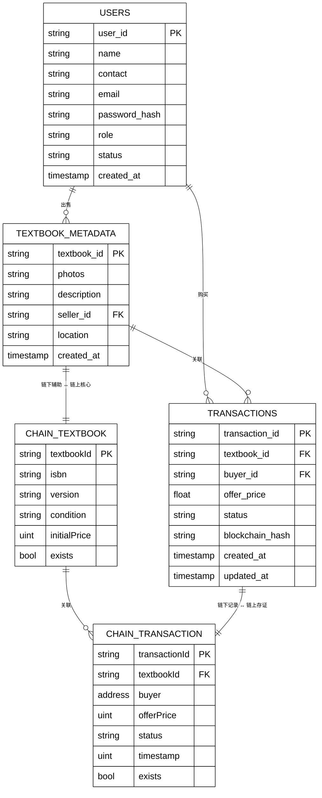
```mermaid
%%{init: {'theme': 'base', 'themeVariables': {'fontSize': '24px', 'primaryColor': '#ffffff', 'primaryTextColor': '#000000', 'primaryBorderColor': '#000000', 'lineColor': '#000000', 'secondaryColor': '#ffffff', 'tertiaryColor': '#ffffff', 'background': '#ffffff', 'mainBkg': '#ffffff', 'nodeBorder': '#000000', 'clusterBkg': '#ffffff', 'clusterBorder': '#000000', 'titleColor': '#000000', 'edgeLabelBackground': '#ffffff', 'nodeTextColor': '#000000'}}}%%
erDiagram
    USERS {
        string user_id PK
        string name
        string contact
        string email
        string password_hash
        string role
        string status
        timestamp created_at
    }

    TEXTBOOK_METADATA {
        string textbook_id PK
        string photos
        string description
        string seller_id FK
        string location
        timestamp created_at
    }

    TRANSACTIONS {
        string transaction_id PK
        string textbook_id FK
        string buyer_id FK
        float offer_price
        string status
        string blockchain_hash
        timestamp created_at
        timestamp updated_at
    }

    CHAIN_TEXTBOOK {
        string textbookId PK
        string isbn
        string version
        string condition
        uint initialPrice
        bool exists
    }

    CHAIN_TRANSACTION {
        string transactionId PK
        string textbookId FK
        address buyer
        uint offerPrice
        string status
        uint timestamp
        bool exists
    }

    USERS ||--o{ TEXTBOOK_METADATA : "出售"
    USERS ||--o{ TRANSACTIONS : "购买"
    TEXTBOOK_METADATA ||--o{ TRANSACTIONS : "关联"
    CHAIN_TEXTBOOK ||--o{ CHAIN_TRANSACTION : "关联"
    TEXTBOOK_METADATA ||--|| CHAIN_TEXTBOOK : "链下辅助 ↔ 链上核心"
    TRANSACTIONS ||--|| CHAIN_TRANSACTION : "链下记录 ↔ 链上存证"
```

---

## 用户管理模块

> 负责用户注册、登录、登出与Session会话维护。

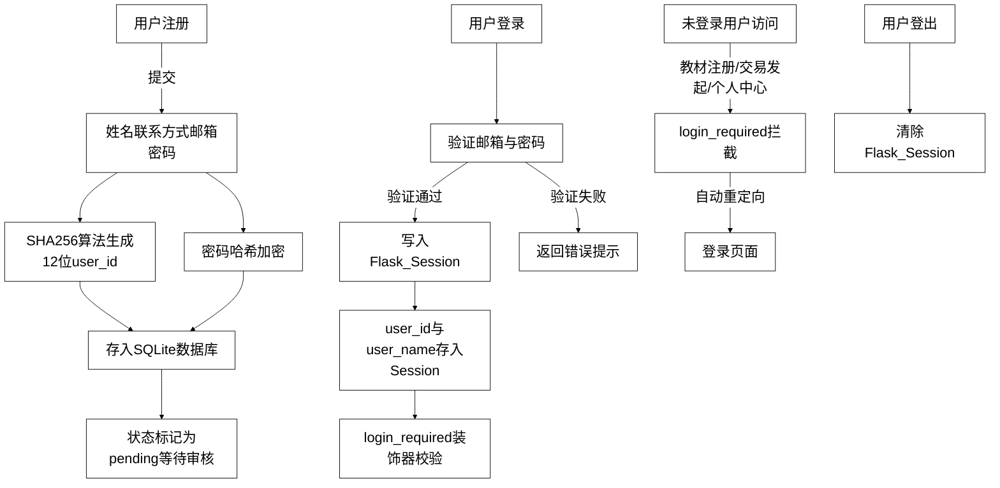
```mermaid
%%{init: {'theme': 'base', 'themeVariables': {'fontSize': '24px', 'primaryColor': '#ffffff', 'primaryTextColor': '#000000', 'primaryBorderColor': '#000000', 'lineColor': '#000000', 'secondaryColor': '#ffffff', 'tertiaryColor': '#ffffff', 'background': '#ffffff', 'mainBkg': '#ffffff', 'nodeBorder': '#000000', 'clusterBkg': '#ffffff', 'clusterBorder': '#000000', 'titleColor': '#000000', 'edgeLabelBackground': '#ffffff', 'nodeTextColor': '#000000'}}}%%
graph TD
    用户注册 -->|提交| 姓名联系方式邮箱密码
    姓名联系方式邮箱密码 --> SHA256算法生成12位user_id
    姓名联系方式邮箱密码 --> 密码哈希加密
    SHA256算法生成12位user_id --> 存入SQLite数据库
    密码哈希加密 --> 存入SQLite数据库
    存入SQLite数据库 --> 状态标记为pending等待审核

    用户登录 --> 验证邮箱与密码
    验证邮箱与密码 -->|验证通过| 写入Flask_Session
    写入Flask_Session --> user_id与user_name存入Session
    user_id与user_name存入Session --> login_required装饰器校验

    验证邮箱与密码 -->|验证失败| 返回错误提示

    未登录用户访问 -->|教材注册/交易发起/个人中心| login_required拦截
    login_required拦截 -->|自动重定向| 登录页面

    用户登出 --> 清除Flask_Session
```

## 教材管理模块

> 负责教材信息的注册登记、详情查询以及搜索功能。

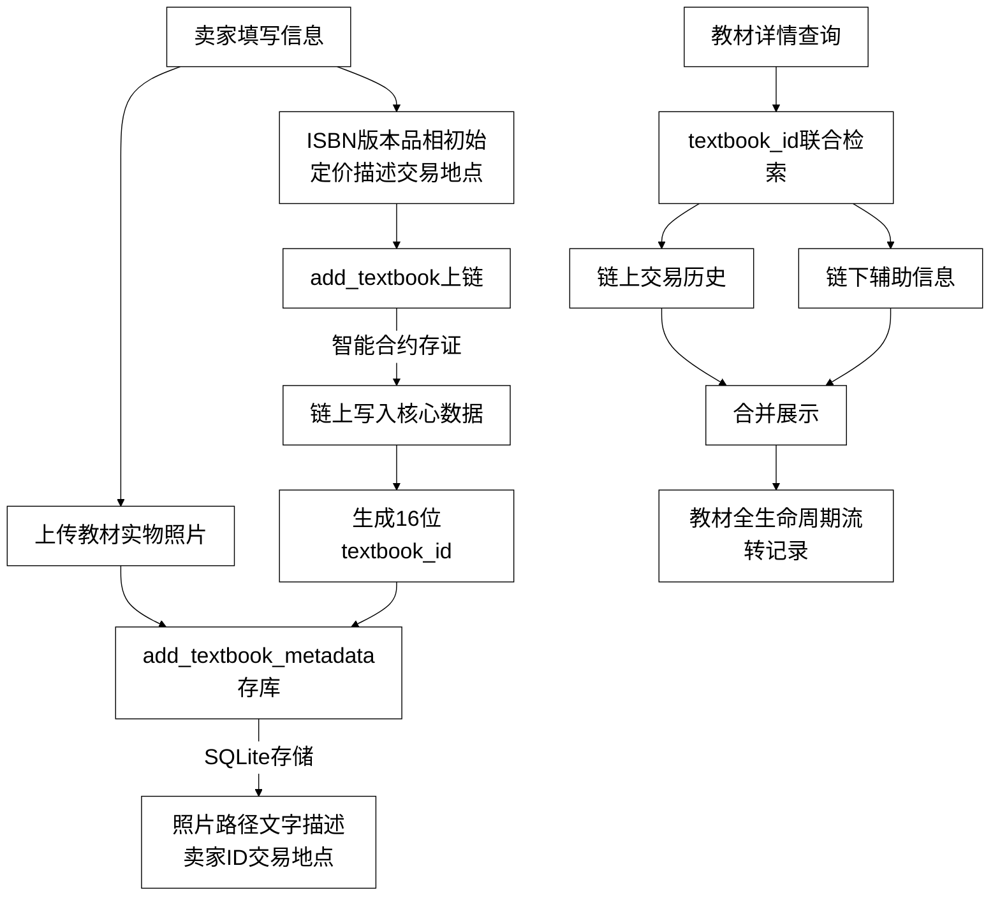
```mermaid
%%{init: {'theme': 'base', 'themeVariables': {'fontSize': '24px', 'primaryColor': '#ffffff', 'primaryTextColor': '#000000', 'primaryBorderColor': '#000000', 'lineColor': '#000000', 'secondaryColor': '#ffffff', 'tertiaryColor': '#ffffff', 'background': '#ffffff', 'mainBkg': '#ffffff', 'nodeBorder': '#000000', 'clusterBkg': '#ffffff', 'clusterBorder': '#000000', 'titleColor': '#000000', 'edgeLabelBackground': '#ffffff', 'nodeTextColor': '#000000'}}}%%
graph TD
    卖家填写信息 --> ISBN版本品相初始定价描述交易地点
    卖家填写信息 --> 上传教材实物照片

    ISBN版本品相初始定价描述交易地点 --> add_textbook上链
    add_textbook上链 -->|智能合约存证| 链上写入核心数据
    链上写入核心数据 --> 生成16位textbook_id

    上传教材实物照片 --> add_textbook_metadata存库
    生成16位textbook_id --> add_textbook_metadata存库
    add_textbook_metadata存库 -->|SQLite存储| 照片路径文字描述卖家ID交易地点

    教材详情查询 --> textbook_id联合检索
    textbook_id联合检索 --> 链上交易历史
    textbook_id联合检索 --> 链下辅助信息
    链上交易历史 --> 合并展示
    链下辅助信息 --> 合并展示
    合并展示 --> 教材全生命周期流转记录
```

## 交易管理模块

> 核心业务模块，负责交易发起、交易确认以及交易拒绝三大闭环操作。

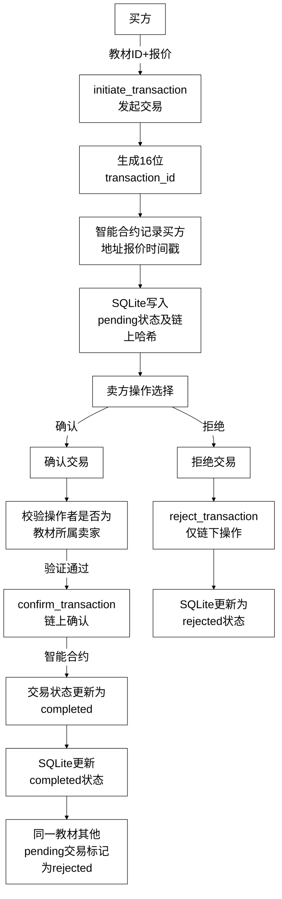
```mermaid
%%{init: {'theme': 'base', 'themeVariables': {'fontSize': '24px', 'primaryColor': '#ffffff', 'primaryTextColor': '#000000', 'primaryBorderColor': '#000000', 'lineColor': '#000000', 'secondaryColor': '#ffffff', 'tertiaryColor': '#ffffff', 'background': '#ffffff', 'mainBkg': '#ffffff', 'nodeBorder': '#000000', 'clusterBkg': '#ffffff', 'clusterBorder': '#000000', 'titleColor': '#000000', 'edgeLabelBackground': '#ffffff', 'nodeTextColor': '#000000'}}}%%
graph TD
    买方 -->|教材ID+报价| initiate_transaction发起交易
    initiate_transaction发起交易 --> 生成16位transaction_id
    生成16位transaction_id --> 智能合约记录买方地址报价时间戳
    智能合约记录买方地址报价时间戳 --> SQLite写入pending状态及链上哈希

    SQLite写入pending状态及链上哈希 --> 卖方操作选择
    卖方操作选择 -->|确认| 确认交易
    卖方操作选择 -->|拒绝| 拒绝交易

    确认交易 --> 校验操作者是否为教材所属卖家
    校验操作者是否为教材所属卖家 -->|验证通过| confirm_transaction链上确认
    confirm_transaction链上确认 -->|智能合约| 交易状态更新为completed
    交易状态更新为completed --> SQLite更新completed状态
    SQLite更新completed状态 --> 同一教材其他pending交易标记为rejected

    拒绝交易 --> reject_transaction仅链下操作
    reject_transaction仅链下操作 --> SQLite更新为rejected状态

    style 确认交易 fill:#fff,stroke:#000
    style 拒绝交易 fill:#fff,stroke:#000
```

## 区块链查询模块

> 提供区块链状态浏览以及交易溯源两大功能。

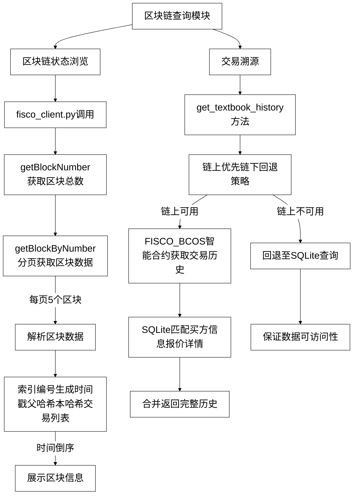
```mermaid
%%{init: {'theme': 'base', 'themeVariables': {'fontSize': '24px', 'primaryColor': '#ffffff', 'primaryTextColor': '#000000', 'primaryBorderColor': '#000000', 'lineColor': '#000000', 'secondaryColor': '#ffffff', 'tertiaryColor': '#ffffff', 'background': '#ffffff', 'mainBkg': '#ffffff', 'nodeBorder': '#000000', 'clusterBkg': '#ffffff', 'clusterBorder': '#000000', 'titleColor': '#000000', 'edgeLabelBackground': '#ffffff', 'nodeTextColor': '#000000'}}}%%
graph TD
    区块链查询模块 --> 区块链状态浏览
    区块链查询模块 --> 交易溯源

    区块链状态浏览 --> fisco_client.py调用
    fisco_client.py调用 --> getBlockNumber获取区块总数
    getBlockNumber获取区块总数 --> getBlockByNumber分页获取区块数据
    getBlockByNumber分页获取区块数据 -->|每页5个区块| 解析区块数据
    解析区块数据 --> 索引编号生成时间戳父哈希本哈希交易列表
    索引编号生成时间戳父哈希本哈希交易列表 -->|时间倒序| 展示区块信息

    交易溯源 --> get_textbook_history方法
    get_textbook_history方法 --> 链上优先链下回退策略

    链上优先链下回退策略 -->|链上可用| FISCO_BCOS智能合约获取交易历史
    FISCO_BCOS智能合约获取交易历史 --> SQLite匹配买方信息报价详情
    SQLite匹配买方信息报价详情 --> 合并返回完整历史

    链上优先链下回退策略 -->|链上不可用| 回退至SQLite查询
    回退至SQLite查询 --> 保证数据可访问性
```

## 链上链下数据协同模块

> 贯穿教材管理以及交易管理全流程，实现链上核心存证以及链下辅助信息的自动关联以及联动查询。

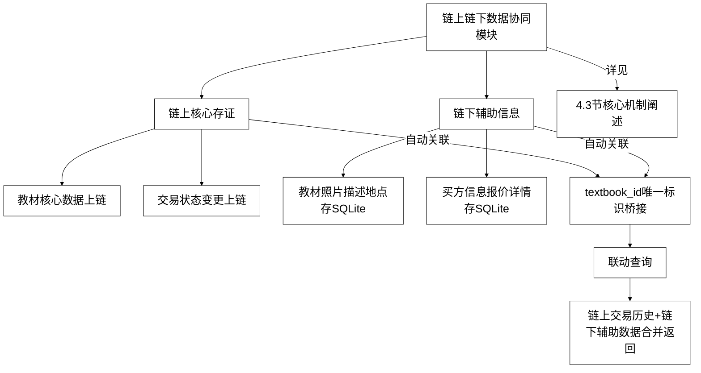
```mermaid
%%{init: {'theme': 'base', 'themeVariables': {'fontSize': '24px', 'primaryColor': '#ffffff', 'primaryTextColor': '#000000', 'primaryBorderColor': '#000000', 'lineColor': '#000000', 'secondaryColor': '#ffffff', 'tertiaryColor': '#ffffff', 'background': '#ffffff', 'mainBkg': '#ffffff', 'nodeBorder': '#000000', 'clusterBkg': '#ffffff', 'clusterBorder': '#000000', 'titleColor': '#000000', 'edgeLabelBackground': '#ffffff', 'nodeTextColor': '#000000'}}}%%
graph TD
    链上链下数据协同模块 --> 链上核心存证
    链上链下数据协同模块 --> 链下辅助信息

    链上核心存证 --> 教材核心数据上链
    链上核心存证 --> 交易状态变更上链

    链下辅助信息 --> 教材照片描述地点存SQLite
    链下辅助信息 --> 买方信息报价详情存SQLite

    链上核心存证 -->|自动关联| textbook_id唯一标识桥接
    链下辅助信息 -->|自动关联| textbook_id唯一标识桥接

    textbook_id唯一标识桥接 --> 联动查询
    联动查询 --> 链上交易历史+链下辅助数据合并返回

    链上链下数据协同模块 -->|详见| 4.3节核心机制阐述
```

---

## 智能合约数据结构

> TextbookTrading 合约定义了两组核心数据结构，均运用 Solidity struct 类型，通过 mapping 映射实现基于唯一标识的快速存取。

### Textbook 结构体

| 字段名 | 类型 | 说明 |
|--------|------|------|
| textbookId | string | 教材唯一标识 |
| isbn | string | 国际标准书号 |
| version | string | 版本信息 |
| condition | string | 品相等级 |
| initialPrice | uint256 | 初始定价（以分为单位存储，避免浮点精度问题） |
| exists | bool | 存在性标记，区分空映射与已注册教材 |

存储映射：`mapping(string => Textbook) private textbooks`，以 textbookId 为键

### Transaction 结构体

| 字段名 | 类型 | 说明 |
|--------|------|------|
| transactionId | string | 交易唯一标识 |
| textbookId | string | 关联教材标识 |
| buyer | address | 买方区块链地址 |
| offerPrice | uint256 | 买方报价（以分为单位） |
| status | string | 交易状态："pending" 待确认 / "completed" 已完成 |
| timestamp | uint256 | 交易时间戳（区块时间） |
| exists | bool | 存在性标记 |

存储映射：`mapping(string => Transaction) private transactions`，以 transactionId 为键

辅助映射：`mapping(string => string[]) private textbookTransactions`，按教材维度追溯完整交易历史

---

## registerTextbook 函数

> 接收教材五参数，校验重复后构造结构体写入映射，触发事件经PBFT共识永久上链。

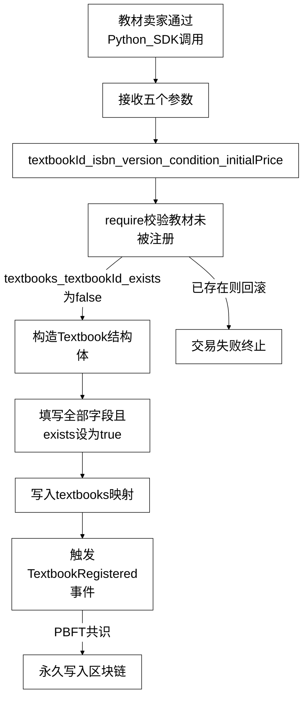
```mermaid
%%{init: {'theme': 'base', 'themeVariables': {'fontSize': '24px', 'primaryColor': '#ffffff', 'primaryTextColor': '#000000', 'primaryBorderColor': '#000000', 'lineColor': '#000000', 'secondaryColor': '#ffffff', 'tertiaryColor': '#ffffff', 'background': '#ffffff', 'mainBkg': '#ffffff', 'nodeBorder': '#000000', 'clusterBkg': '#ffffff', 'clusterBorder': '#000000', 'titleColor': '#000000', 'edgeLabelBackground': '#ffffff', 'nodeTextColor': '#000000'}}}%%
graph TD
    教材卖家通过Python_SDK调用 --> 接收五个参数
    接收五个参数 --> textbookId_isbn_version_condition_initialPrice

    textbookId_isbn_version_condition_initialPrice --> require校验教材未被注册
    require校验教材未被注册 -->|textbooks_textbookId_exists为false| 构造Textbook结构体
    require校验教材未被注册 -->|已存在则回滚| 交易失败终止

    构造Textbook结构体 --> 填写全部字段且exists设为true
    填写全部字段且exists设为true --> 写入textbooks映射
    写入textbooks映射 --> 触发TextbookRegistered事件
    触发TextbookRegistered事件 -->|PBFT共识| 永久写入区块链
```

## initiateTransaction 函数

> 接收交易三参数，双重校验后构造结构体，buyer取msg.sender，追加至教材交易列表。

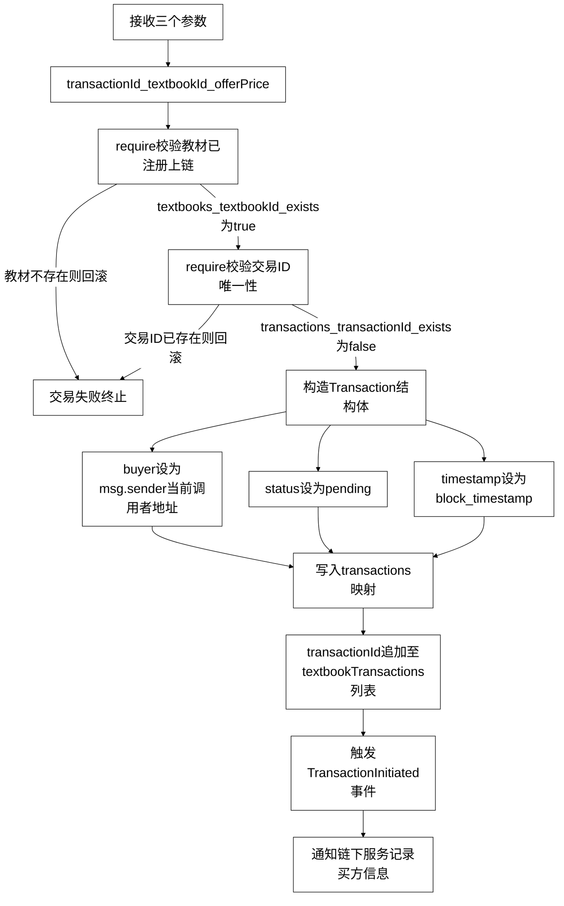
```mermaid
%%{init: {'theme': 'base', 'themeVariables': {'fontSize': '24px', 'primaryColor': '#ffffff', 'primaryTextColor': '#000000', 'primaryBorderColor': '#000000', 'lineColor': '#000000', 'secondaryColor': '#ffffff', 'tertiaryColor': '#ffffff', 'background': '#ffffff', 'mainBkg': '#ffffff', 'nodeBorder': '#000000', 'clusterBkg': '#ffffff', 'clusterBorder': '#000000', 'titleColor': '#000000', 'edgeLabelBackground': '#ffffff', 'nodeTextColor': '#000000'}}}%%
graph TD
    接收三个参数 --> transactionId_textbookId_offerPrice

    transactionId_textbookId_offerPrice --> require校验教材已注册上链
    require校验教材已注册上链 -->|textbooks_textbookId_exists为true| require校验交易ID唯一性
    require校验教材已注册上链 -->|教材不存在则回滚| 交易失败终止

    require校验交易ID唯一性 -->|transactions_transactionId_exists为false| 构造Transaction结构体
    require校验交易ID唯一性 -->|交易ID已存在则回滚| 交易失败终止

    构造Transaction结构体 --> buyer设为msg.sender当前调用者地址
    构造Transaction结构体 --> status设为pending
    构造Transaction结构体 --> timestamp设为block_timestamp
    buyer设为msg.sender当前调用者地址 --> 写入transactions映射
    status设为pending --> 写入transactions映射
    timestamp设为block_timestamp --> 写入transactions映射
    写入transactions映射 --> transactionId追加至textbookTransactions列表
    transactionId追加至textbookTransactions列表 --> 触发TransactionInitiated事件
    触发TransactionInitiated事件 --> 通知链下服务记录买方信息
```

## confirmTransaction 函数

> 校验交易存在与pending状态后更新为completed，卖家权限由链下业务层验证。

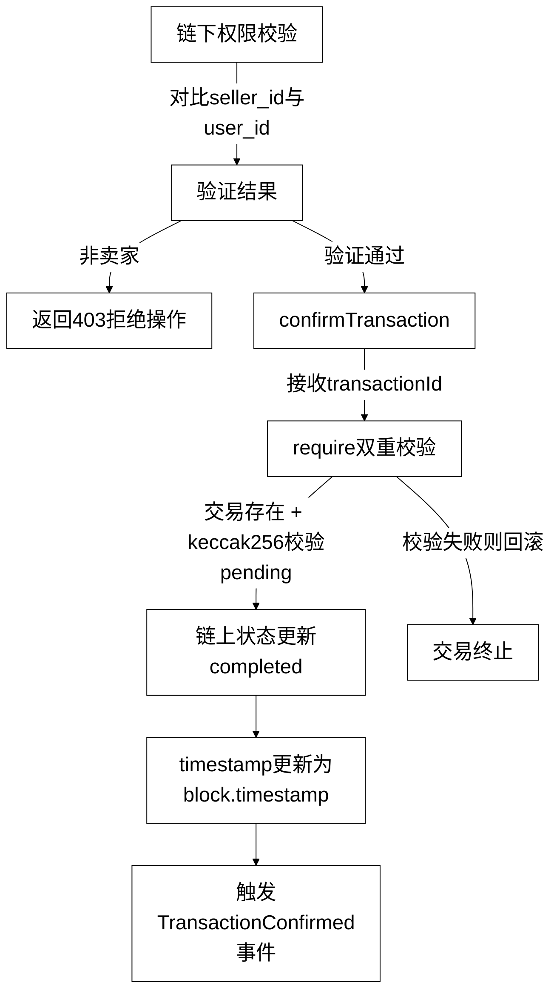
```mermaid
%%{init: {'theme': 'base', 'themeVariables': {'fontSize': '24px', 'primaryColor': '#ffffff', 'primaryTextColor': '#000000', 'primaryBorderColor': '#000000', 'lineColor': '#000000', 'secondaryColor': '#ffffff', 'tertiaryColor': '#ffffff', 'background': '#ffffff', 'mainBkg': '#ffffff', 'nodeBorder': '#000000', 'clusterBkg': '#ffffff', 'clusterBorder': '#000000', 'titleColor': '#000000', 'edgeLabelBackground': '#ffffff', 'nodeTextColor': '#000000'}}}%%
graph TD
    链下权限校验 -->|对比seller_id与user_id| 验证结果
    验证结果 -->|非卖家| 返回403拒绝操作

    验证结果 -->|验证通过| confirmTransaction
    confirmTransaction -->|接收transactionId| require双重校验
    require双重校验 -->|交易存在 + keccak256校验pending| 链上状态更新completed
    require双重校验 -->|校验失败则回滚| 交易终止

    链上状态更新completed --> timestamp更新为block.timestamp
    timestamp更新为block.timestamp --> 触发TransactionConfirmed事件
```

## 查询函数组

> public view函数，不消耗Gas，不修改链上状态，由Python SDK client.call()调用。

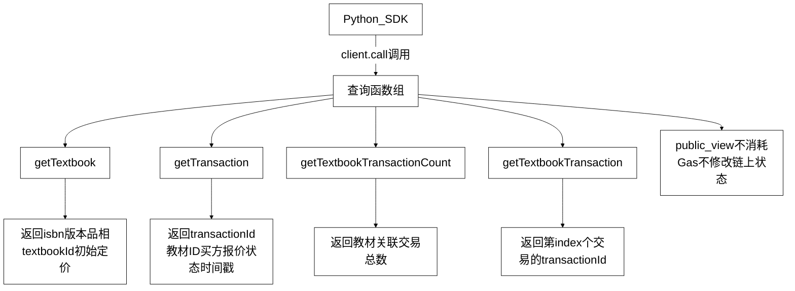
```mermaid
%%{init: {'theme': 'base', 'themeVariables': {'fontSize': '24px', 'primaryColor': '#ffffff', 'primaryTextColor': '#000000', 'primaryBorderColor': '#000000', 'lineColor': '#000000', 'secondaryColor': '#ffffff', 'tertiaryColor': '#ffffff', 'background': '#ffffff', 'mainBkg': '#ffffff', 'nodeBorder': '#000000', 'clusterBkg': '#ffffff', 'clusterBorder': '#000000', 'titleColor': '#000000', 'edgeLabelBackground': '#ffffff', 'nodeTextColor': '#000000'}}}%%
graph TD
    Python_SDK -->|client.call调用| 查询函数组

    查询函数组 --> getTextbook
    查询函数组 --> getTransaction
    查询函数组 --> getTextbookTransactionCount
    查询函数组 --> getTextbookTransaction

    getTextbook --> 返回isbn版本品相textbookId初始定价
    getTransaction --> 返回transactionId教材ID买方报价状态时间戳
    getTextbookTransactionCount --> 返回教材关联交易总数
    getTextbookTransaction --> 返回第index个交易的transactionId

    查询函数组 --> public_view不消耗Gas不修改链上状态
```

---

## 链上链下协同查询流程

> 教材详情查询执行"先链上、后链下"的协同查询，链上不可用时自动回退SQLite离线模式。

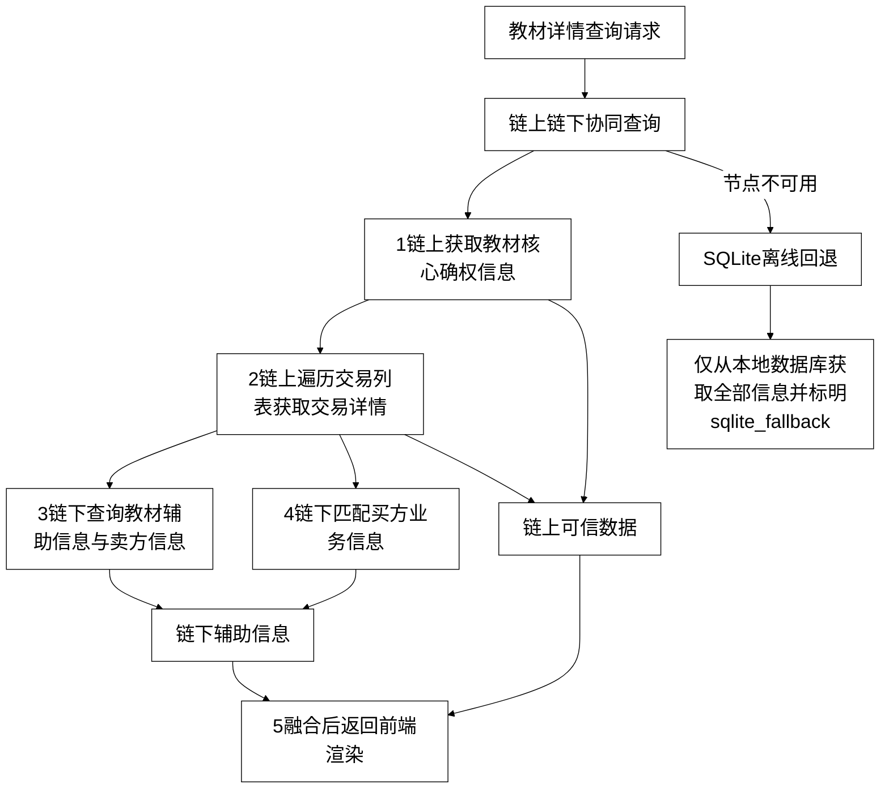
```mermaid
%%{init: {'theme': 'base', 'themeVariables': {'fontSize': '24px', 'primaryColor': '#ffffff', 'primaryTextColor': '#000000', 'primaryBorderColor': '#000000', 'lineColor': '#000000', 'secondaryColor': '#ffffff', 'tertiaryColor': '#ffffff', 'background': '#ffffff', 'mainBkg': '#ffffff', 'nodeBorder': '#000000', 'clusterBkg': '#ffffff', 'clusterBorder': '#000000', 'titleColor': '#000000', 'edgeLabelBackground': '#ffffff', 'nodeTextColor': '#000000'}}}%%
graph TD
    教材详情查询请求 --> 链上链下协同查询

    链上链下协同查询 --> 1链上获取教材核心确权信息
    1链上获取教材核心确权信息 --> 2链上遍历交易列表获取交易详情

    2链上遍历交易列表获取交易详情 --> 3链下查询教材辅助信息与卖方信息
    2链上遍历交易列表获取交易详情 --> 4链下匹配买方业务信息

    1链上获取教材核心确权信息 --> 链上可信数据
    2链上遍历交易列表获取交易详情 --> 链上可信数据
    3链下查询教材辅助信息与卖方信息 --> 链下辅助信息
    4链下匹配买方业务信息 --> 链下辅助信息

    链上可信数据 --> 5融合后返回前端渲染
    链下辅助信息 --> 5融合后返回前端渲染

    链上链下协同查询 -->|节点不可用| SQLite离线回退
    SQLite离线回退 --> 仅从本地数据库获取全部信息并标明sqlite_fallback
```

---

## 4.5.1 教材注册流程

> 教材信息上链存证与辅助信息入库的联动操作。

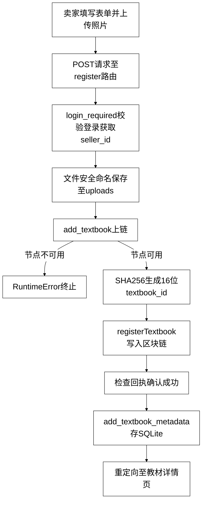
```mermaid
%%{init: {'theme': 'base', 'themeVariables': {'fontSize': '24px', 'primaryColor': '#ffffff', 'primaryTextColor': '#000000', 'primaryBorderColor': '#000000', 'lineColor': '#000000', 'secondaryColor': '#ffffff', 'tertiaryColor': '#ffffff', 'background': '#ffffff', 'mainBkg': '#ffffff', 'nodeBorder': '#000000', 'clusterBkg': '#ffffff', 'clusterBorder': '#000000', 'titleColor': '#000000', 'edgeLabelBackground': '#ffffff', 'nodeTextColor': '#000000'}}}%%
graph TD
    卖家填写表单并上传照片 --> POST请求至register路由
    POST请求至register路由 --> login_required校验登录获取seller_id
    login_required校验登录获取seller_id --> 文件安全命名保存至uploads
    文件安全命名保存至uploads --> add_textbook上链
    add_textbook上链 -->|节点不可用| RuntimeError终止
    add_textbook上链 -->|节点可用| SHA256生成16位textbook_id
    SHA256生成16位textbook_id --> registerTextbook写入区块链
    registerTextbook写入区块链 --> 检查回执确认成功
    检查回执确认成功 --> add_textbook_metadata存SQLite
    add_textbook_metadata存SQLite --> 重定向至教材详情页
```

## 4.5.2 交易发起流程

> 买方报价操作，链上写入与链下存储的双重操作。

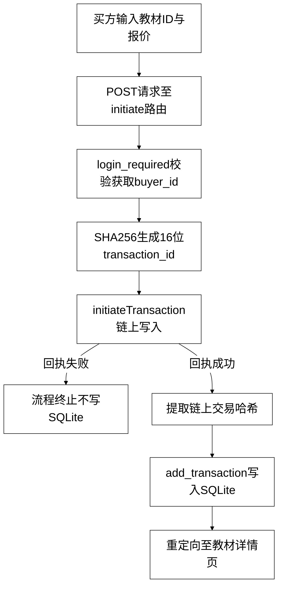
```mermaid
%%{init: {'theme': 'base', 'themeVariables': {'fontSize': '24px', 'primaryColor': '#ffffff', 'primaryTextColor': '#000000', 'primaryBorderColor': '#000000', 'lineColor': '#000000', 'secondaryColor': '#ffffff', 'tertiaryColor': '#ffffff', 'background': '#ffffff', 'mainBkg': '#ffffff', 'nodeBorder': '#000000', 'clusterBkg': '#ffffff', 'clusterBorder': '#000000', 'titleColor': '#000000', 'edgeLabelBackground': '#ffffff', 'nodeTextColor': '#000000'}}}%%
graph TD
    买方输入教材ID与报价 --> POST请求至initiate路由
    POST请求至initiate路由 --> login_required校验获取buyer_id
    login_required校验获取buyer_id --> SHA256生成16位transaction_id
    SHA256生成16位transaction_id --> initiateTransaction链上写入
    initiateTransaction链上写入 -->|回执失败| 流程终止不写SQLite
    initiateTransaction链上写入 -->|回执成功| 提取链上交易哈希
    提取链上交易哈希 --> add_transaction写入SQLite
    add_transaction写入SQLite --> 重定向至教材详情页
```

## 4.5.3 交易确认与拒绝流程

> 卖家接受或拒绝报价，确认时链上更新状态并拒绝其他pending交易。

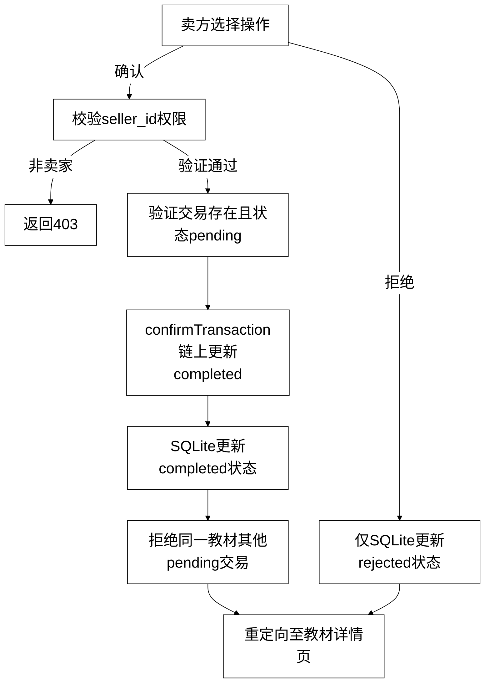
```mermaid
%%{init: {'theme': 'base', 'themeVariables': {'fontSize': '24px', 'primaryColor': '#ffffff', 'primaryTextColor': '#000000', 'primaryBorderColor': '#000000', 'lineColor': '#000000', 'secondaryColor': '#ffffff', 'tertiaryColor': '#ffffff', 'background': '#ffffff', 'mainBkg': '#ffffff', 'nodeBorder': '#000000', 'clusterBkg': '#ffffff', 'clusterBorder': '#000000', 'titleColor': '#000000', 'edgeLabelBackground': '#ffffff', 'nodeTextColor': '#000000'}}}%%
graph TD
    卖方选择操作 -->|确认| 校验seller_id权限
    校验seller_id权限 -->|非卖家| 返回403
    校验seller_id权限 -->|验证通过| 验证交易存在且状态pending
    验证交易存在且状态pending --> confirmTransaction链上更新completed
    confirmTransaction链上更新completed --> SQLite更新completed状态
    SQLite更新completed状态 --> 拒绝同一教材其他pending交易
    拒绝同一教材其他pending交易 --> 重定向至教材详情页

    卖方选择操作 -->|拒绝| 仅SQLite更新rejected状态
    仅SQLite更新rejected状态 --> 重定向至教材详情页
```

---

## 4.6.1 节点配置与SDK集成

> fisco_config.py集中管理连接参数，fisco_client.py初始化时编译合约、连接节点、部署/加载合约地址。

```mermaid
%%{init: {'theme': 'base', 'themeVariables': {'fontSize': '24px', 'primaryColor': '#ffffff', 'primaryTextColor': '#000000', 'primaryBorderColor': '#000000', 'lineColor': '#000000', 'secondaryColor': '#ffffff', 'tertiaryColor': '#ffffff', 'background': '#ffffff', 'mainBkg': '#ffffff', 'nodeBorder': '#000000', 'clusterBkg': '#ffffff', 'clusterBorder': '#000000', 'titleColor': '#000000', 'edgeLabelBackground': '#ffffff', 'nodeTextColor': '#000000'}}}%%
graph TD
    fisco_config.py配置 --> 节点RPC地址192.168.146.129:8545
    fisco_config.py配置 --> 合约名称与源文件路径
    fisco_config.py配置 --> 账户配置用于交易签名
    fisco_config.py配置 --> python-sdk路径动态添加至sys_path

    fisco_client初始化 --> Compiler编译合约生成ABI与BIN
    Compiler编译合约生成ABI与BIN --> BcosClient建立RPC连接
    BcosClient建立RPC连接 --> DatatypeParser加载ABI文件
    DatatypeParser加载ABI文件 --> 检查contract_address_txt
    检查contract_address_txt -->|已存在| 直接加载复用合约地址
    检查contract_address_txt -->|不存在| client.deploy部署新合约
    client.deploy部署新合约 --> 持久化写入contract_address_txt

    is_available检测 --> SDK模块是否导入
    is_available检测 --> BcosClient实例是否存在
    is_available检测 --> 合约地址是否有效且非零地址
    is_available检测 --> getBlockNumber能否成功调用
    is_available检测 -->|任一不满足| 自动进入SQLite离线降级模式
```

## 4.6.2 合约调用封装

> 六种合约操作封装为Python方法，写入方法用sendRawTransactionGetReceipt，查询方法用call。

```mermaid
%%{init: {'theme': 'base', 'themeVariables': {'fontSize': '24px', 'primaryColor': '#ffffff', 'primaryTextColor': '#000000', 'primaryBorderColor': '#000000', 'lineColor': '#000000', 'secondaryColor': '#ffffff', 'tertiaryColor': '#ffffff', 'background': '#ffffff', 'mainBkg': '#ffffff', 'nodeBorder': '#000000', 'clusterBkg': '#ffffff', 'clusterBorder': '#000000', 'titleColor': '#000000', 'edgeLabelBackground': '#ffffff', 'nodeTextColor': '#000000'}}}%%
graph TD
    fisco_client封装 --> 写入方法组
    fisco_client封装 --> 查询方法组

    写入方法组 --> register_textbook -->|映射| registerTextbook合约函数
    写入方法组 --> initiate_transaction -->|映射| initiateTransaction合约函数
    写入方法组 --> confirm_transaction -->|映射| confirmTransaction合约函数

    写入方法组 --> sendRawTransactionGetReceipt接口
    sendRawTransactionGetReceipt接口 --> 传入合约地址ABI函数名参数列表
    传入合约地址ABI函数名参数列表 --> 返回交易回执字典

    查询方法组 --> get_textbook -->|映射| getTextbook合约函数
    查询方法组 --> get_transaction -->|映射| getTransaction合约函数
    查询方法组 --> get_textbook_transaction_count -->|映射| getTextbookTransactionCount合约函数
    查询方法组 --> get_textbook_transaction -->|映射| getTextbookTransaction合约函数

    查询方法组 --> client_call接口
    client_call接口 -->|本地节点查询| 不产生交易不消耗Gas
    不产生交易不消耗Gas --> 返回元组或字典
    返回元组或字典 --> _normalize系列方法解析为标准字典格式